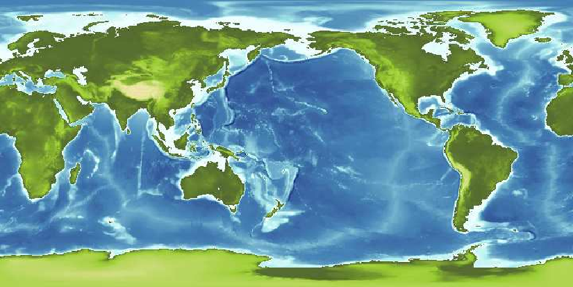

# ncview colormap generator

The good old `ncview` tool is still a very popular and powerful
software, despite its old age. Nonetheless we miss a way to customize
the colormaps according to our needs. This is were this ncview
colormap generator comes into play. With a simple python script you'll
be able to generate your custom colormap!

## Dependencies

This tool only requires:
- python
- numpy
- termcolor
- matplotlib

## Running the tool

To run the tool you need to specify your color intervals (e.g. the first from red to blue, the second from blue to yellow, etc), and the size of each color interval (e.g. 50% and 40%). Of course, an output file is needed as well.

An example of invocation is:

```
$ python cmapGen.py -c "midnightblue,steelblue" -c "steelblue,paleturquoise" -c "paleturquoise,azure" -c "darkolivegreen,yellowgreen" -c "yellowgreen,palegoldenrod" -c "palegoldenrod,peru" -c "peru,white" --percentages=25,20,5,10,20,15,5 --outputfile=myterrain.ncmap
```

And an example result is the following:

<p align="center">

</p>

This is the plot of the "Elevations calculated from the TBASE 5-minute", a free NetCDF file available on the "Joint Institute for the Study of the Atmosphere and Ocean" website.

## Installing the new colormap

`ncview` looks for colormaps in different places. Generally, it looks in `/usr/share/ncview` for system-wide colormap (`.ncmap`) files, but also examines the user's environmental variable `NCVIEWBASE` for the name of a directory which contains additional colormap files. If that is not defined, then colormaps are sought in the user's home directory, and in the directory `ncview` was run from. This information is available in `ncview` man page. Anyway, just copy the new colormap in the system wide folder and you're done. In my GNU/Linux system:

```
$ sudo cp myterrain.ncmap /usr/share/ncview
```
